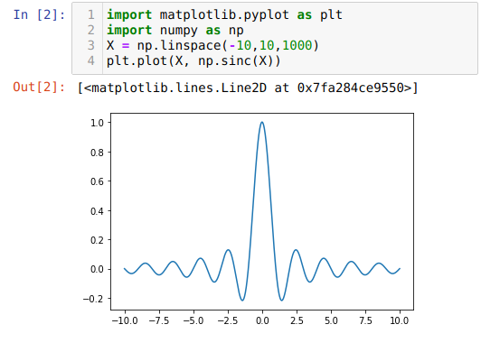
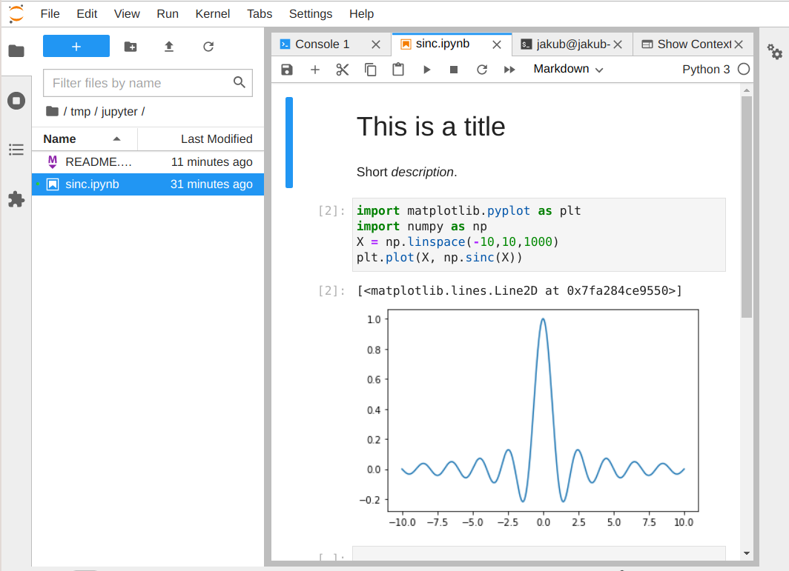

# Jupyter Notebook
My Jupyter Notebooks. An easy way to edit and run Python code snippets in web browser.

Install jupyter notebook:

```$ sudo apt install jupyter-notebook # or 'jupyter'```

Run:

```$ jupyter notebook```

This will spawn local webserver. Open the link you got in browser (localhost:8888)



Usage:
* Each 'cell' (code snippet) can be run using _Shift+Enter_
* 'kernel' is a current python instance
* when cell is run, its side effects stay in the kernel
* Use "Kernel → Restart & Run All" to clear memory and run all cells from the top

Notebook creates `.ipynb` files, that can be uploaded directly to GitHub.

# JupyterLab IDE
This is an IDE in a web-browser. Just better way to edit and manage your jupyter notebooks.

Install:

```$ pip3 install jupyterlab```

Run:

```$ jupyter lab```

Open the link you got in browser (localhost:8889)


